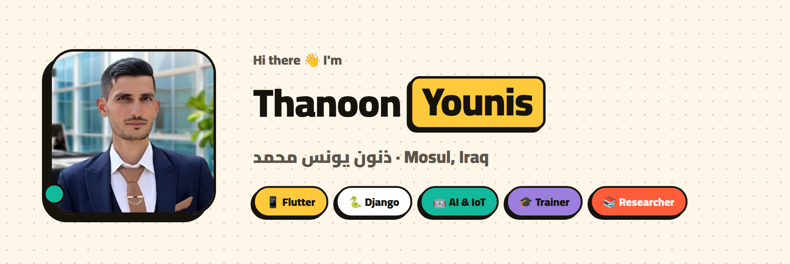
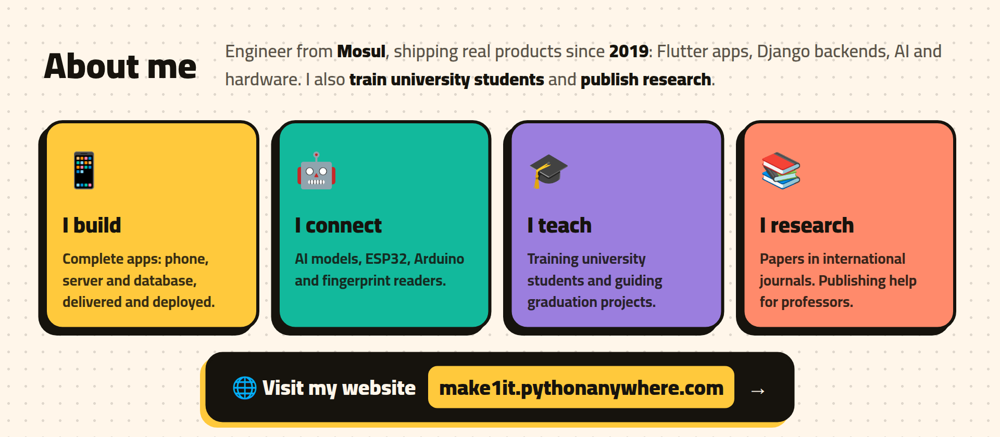
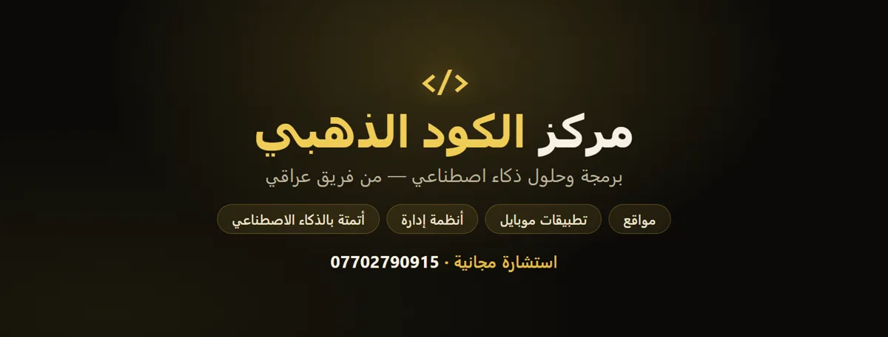
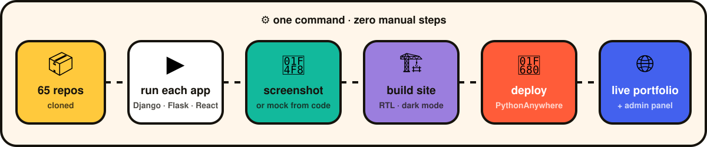
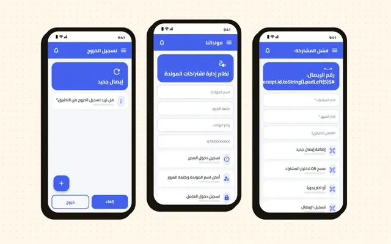
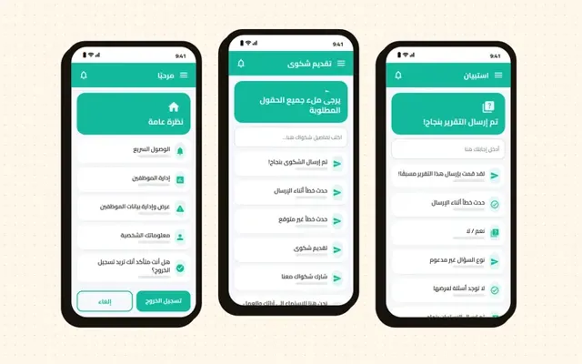
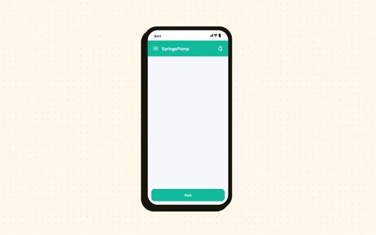

<a href="https://make1it.pythonanywhere.com">
<picture>
  <source media="(prefers-color-scheme: dark)" srcset="assets/hero-dark.png">
  
</picture>
</a>

 

---

<a href="https://make1it.pythonanywhere.com">
<picture>
  <source media="(prefers-color-scheme: dark)" srcset="assets/about-dark.png">
  
</picture>
</a>

<b>🌐 My website: <a href="https://make1it.pythonanywhere.com">make1it.pythonanywhere.com</a></b> — all 64 projects with screenshots, my experience and how to reach me.

---

## ⚙️ My portfolio builds itself

I didn't screenshot or upload a single project by hand. I wrote **[`showcase`](https://github.com/Thanoon12k/My-Work)**, a tool that:
- clones **all 64 of my repositories**
- **runs each one** (it migrates the database for Django apps, creates a demo user and logs in)
- crawls every app in a headless browser and takes desktop and mobile screenshots
- draws a mock-up from the source code of apps that can't run in a browser (Flutter screens, desktop windows, Arduino serial output)
- builds the portfolio site and **deploys it to PythonAnywhere**

It all runs from one command, with **zero manual steps**.

**My Facebook page runs itself too.** [Golden Code](https://www.facebook.com/goldencode114) is fully automated: the code designs every post card, an AI agent schedules and publishes through the Graph API, and a script tracks growth and archives every post.

<a href="https://make1it.pythonanywhere.com"><b>🌐 See the live result</b></a> ·
<a href="https://github.com/Thanoon12k/My-Work"><b>🧩 Read the code</b></a>

---

## ⭐ Featured work

- ⚡ **[Moalidaty · مولدتي](https://github.com/Thanoon12k/moalidaty-front-end)**: runs neighbourhood power generators: subscribers, amperes, payments, payroll and profit. Built with Flutter and a [Django backend](https://github.com/Thanoon12k/moalidaty).
- 🩺 **[Pediatric Clinic · عيادتي](https://github.com/Thanoon12k/Pediatric-Clinic-manager)**: admin, doctor and patient roles, vaccines, growth charts, live chat, and Arabic PDF reports. Built with Flutter, BLoC and Supabase.
- 🏢 **[Employee Manager](https://github.com/Thanoon12k/Employee-Manager)**: surveys, official letters and a director's dashboard for a government department.
- 💉 **[Smart Syringe Pump](https://github.com/Thanoon12k/flutter-arduino-based-syringe-pump)**: a Flutter app that controls an Arduino medical pump, with safety checks and a live 3D syringe.
- 📝 **[Bubble Sheet Scanner](https://github.com/Thanoon12k/BubbleSheetScanner)**: marks exam answer sheets offline with OpenCV and exports the results to Excel.
- 📣 **[Golden Code page](https://www.facebook.com/goldencode114)**: a Facebook page that runs itself. The code designs the post cards, and an AI agent publishes and tracks stats through the Graph API.
- 🕌 **[Mosul Tourism](https://github.com/Thanoon12k/mosul1tourism)** and 💡 **[Fikra](https://github.com/Thanoon12k/Ideas-Store)**: bilingual Flask and Django web apps.

---

## 🛠️ Tech stack

**Also:** REST APIs & auth · BLoC / Provider · Gunicorn · IoT & MQTT · ESP32 · ZKTeco SDK · Playwright automation · OMNeT++ · CloudSim · Visual Basic

---

## 🧭 Journey

| When | What |
|---|---|
| **2019 → now** | 💻 **Backend & Flutter developer**: cross-platform apps, scalable Django / Flask backends, AI integration, full project lifecycle |
| **2021 → now** | 🎓 **Tech trainer & assistant**: training university students and guiding graduation projects; research and publishing services for doctors and professors |
| **2022 – 2023** | 📱 **Mobile developer & technical support**: Flutter + Firebase, notifications, real-time databases |
| **2021 – 2023** | 🖧 **Server administrator**: Ubuntu, Gunicorn, Redis, security and monitoring |
| **2018 – 2022** | 🎓 **B.Sc. Computer Technical Engineering** (Networks & Communication), Northern Technical University |
| **2019 – 2020** | 🖥️ **Desktop developer**: enterprise apps in Visual Basic and C/C++ |

📚 Papers published in international journals · 🏕️ Hello Muscat programming bootcamp (2023) · 🤝 MetaLux team contributor · 🗣️ Arabic (native), English (excellent)

---

## 📈 On GitHub

---

### 🤝 Let's build something

**Need an app, a management system, device integration, or help with research?**
 

Be patient … the best things are built step by step.

